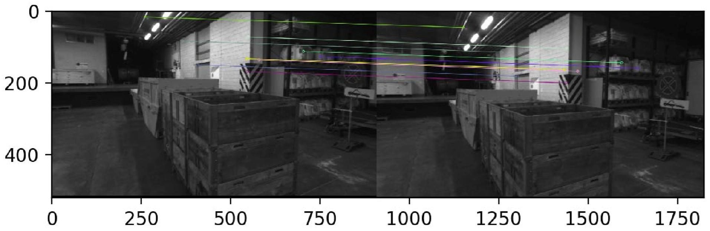
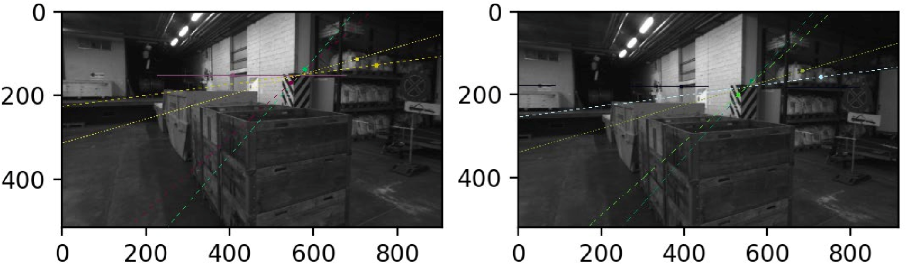
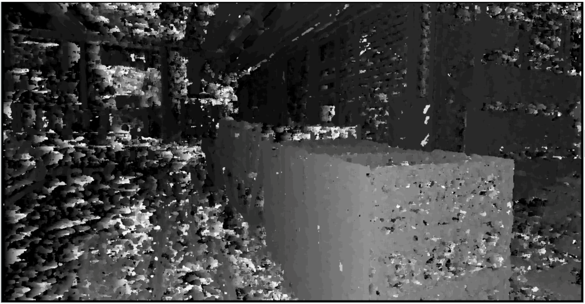
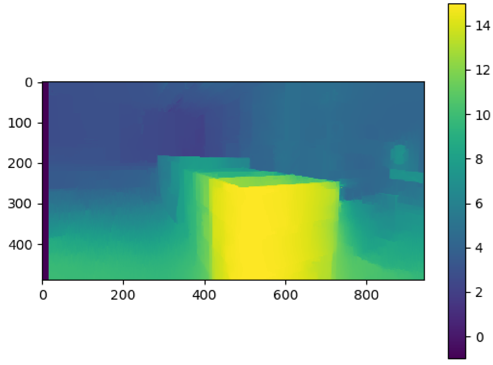

# 3D Reconstruction with SGBM, SIFT, SSD and 8pt

## Overview
We use paired images to do 3D reconstruction with SGBM, SIFT, SSD and 8pt algorithm.

## Experiment Result
                                                    **SIFT feature extraction**

                                                       **8pt Epipolarline**

                                                        **SSD Disparity**

                                                        **SGBM Disparity**

